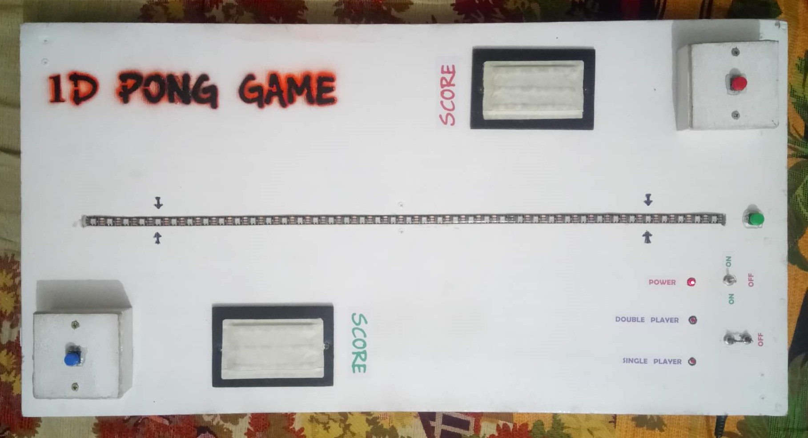

# 1D-Pong
 A arduino based LED strip 1 dimensional pong game. (2018)

 This is made for my Electronics Laboratory in 2018. This is a 1 dimensional pong game made with an addressable LED strip and arduino. Though my senior teacher didn't like the concept, but the student was amused by it. That how led can be used to make a game.

 ## Project description
Name: 1D Pong  
Programming Language: C/C++  
Platform: Arduino Project
Project No: 10  
Year: 2018

## Parts use
<ul>
  <li>Arduino Nano</li>
  <li>WS2812B LED Strip</li>
  <li>5V Power Supply</li>
  <li>Push Button</li>
  <li>Latch Switch</li>
  <li>DC Jack</li>
  <li>Wires</li>
</ul>

## Demo Video
<!--  -->

## Screen shot
### Board and the Circuit Desing
 

 

 

### Borad 
 

### Play Demo 
 

## Authors

* **AbirHasan**

Check out my other works [@XAbirHasan](https://github.com/XAbirHasan)
